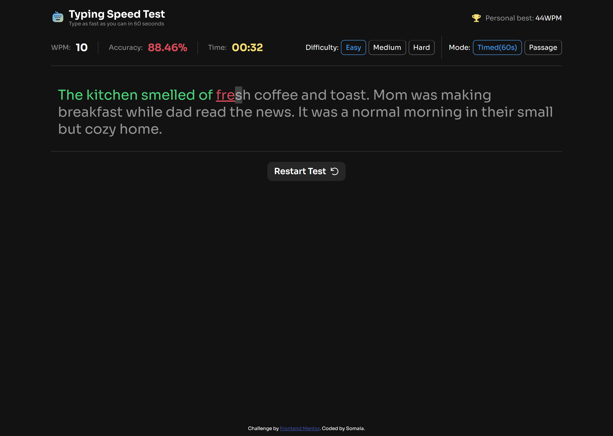
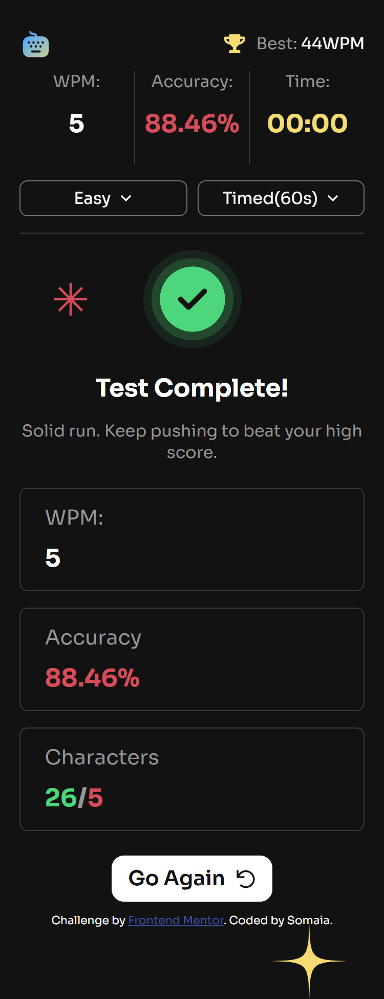

# Frontend Mentor - Typing Speed Test solution

This is a solution to the [Typing Speed Test challenge on Frontend Mentor](https://www.frontendmentor.io/challenges/typing-speed-test). Frontend Mentor challenges help you improve your coding skills by building realistic projects. 

## Table of contents

- [Overview](#overview)
  - [The challenge](#the-challenge)
  - [Screenshot](#screenshot)
  - [Links](#links)
- [My process](#my-process)
  - [Built with](#built-with)
  - [What I learned](#what-i-learned)
  - [Continued development](#continued-development)
  - [Useful resources](#useful-resources)
- [Author](#author)
- [Acknowledgments](#acknowledgments)


## Overview

### The challenge

Users should be able to:

- View the optimal layout for the interface depending on their device's screen size
- See hover and focus states for all interactive elements on the page

### Screenshot




### Links

- Live Site URL: [Live site](https://somaia02.github.io/typing-test/)

## My process

### Built with

- Semantic HTML5 markup
- CSS custom properties
- Flexbox
- CSS Grid
- Mobile-first workflow
- [Webpack](https://webpack.js.org/) - JS bundler

### What I learned

I learned how to bundle JavaScript files using Webpack and how to automatically deploy a project.

```json
"scripts": {
  "test": "echo \"Error: no test specified\" && exit 1",
  "start": "webpack serve --open --mode development",
  "build": "rimraf dist && webpack --mode production",
  "deploy": "npm run build && gh-pages -d dist"
},
```

### Continued development
I want to learn more about organizing code (CSS and JavaScript). 

### Useful resources

- [Webpack docs](https://webpack.js.org/concepts/) - This helped me for getting started with Webpack
- [Creating webccomponents](https://www.youtube.com/watch?v=b_x3kzapvcI) - This is an amazing video which helped me learn how to build a web component with JavaScript

## Author

- Frontend Mentor - [@somaia02](https://www.frontendmentor.io/profile/somaia02)

## Acknowledgments

I would like to thank Grace-snow and Darkstar from Frontend Mentor Discord server.
